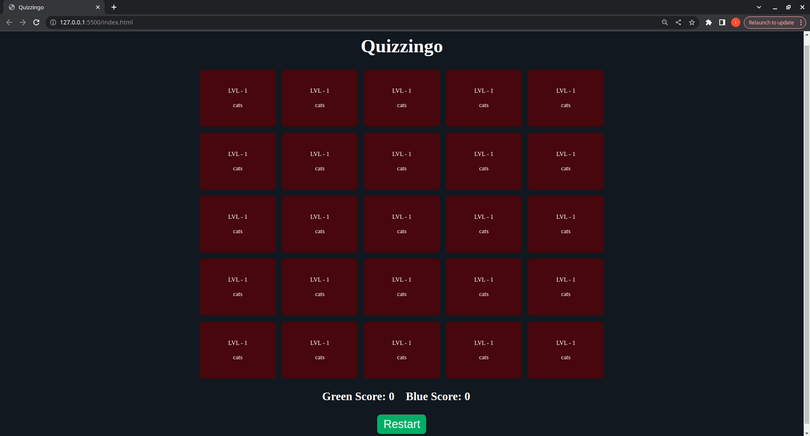

# Quizzingo

## Set up game data

1. Replace data in `data/cards.json` file

## Run application

1. Install `ritwickdey.liveserver` from Extensions Marketplace
1. Right click on the `index.html` file and choose `Open with Live Server`
1. Have fun!

